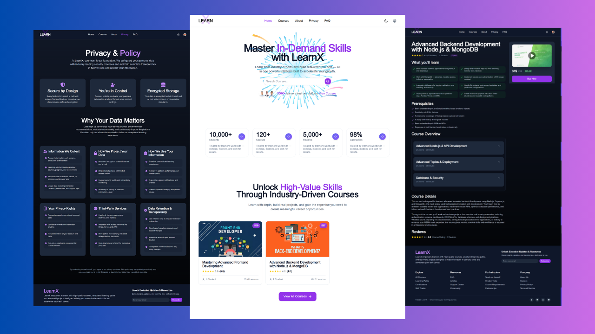

# LearnX | Production-Grade LMS Platform

**LearnX** is a modern, full-featured **Learning Management System (LMS)** built with a powerful **TypeScript-first MERN architecture (Next.js + Node/Express).**
Designed for secure, scalable online education, LearnX enables instructors to sell premium courses while ensuring protected video delivery, seamless payments, real-time analytics, and structured course management.

From DRM-protected streaming to Stripe-powered transactions and live platform insights — LearnX blends **security, performance, and product-driven architecture** into one scalable ecosystem.



<br />

<p align="center">
  <a href="https://the-learnx.vercel.app/" target="_blank">
    
  </a>

  <a href="https://www.youtube.com/watch?v=YOUR_VIDEO_LINK" target="_blank">
    
  </a>

  <a href="https://github.com/adilarain00/the-learnx" target="_blank">
    
  </a>

  <a href="https://aadil-amjad.me/project/the-learnx" target="_blank">
    
  </a>
</p>

---

## Tech Stack

- **🎨 Frontend:** Next.js 13+, React 18, TypeScript, Redux Toolkit + RTK Query, Tailwind CSS, Material UI
- **⚙️ Backend:** Node.js, Express.js, TypeScript
- **🗄 Database & Caching:** MongoDB, Mongoose, Redis
- **🔐 Authentication & Security:** JWT, bcryptjs, NextAuth
- **💳 Payments:** Stripe
- **📺 Secure Video Delivery:** VdoCipher (DRM + Watermark Protection)
- **📧 Email System:** Nodemailer
- **⚡ Real-time Features:** Socket.io
- **☁️ Media Storage:** Cloudinary
- **🚀 Deployment:** Vercel (Frontend), Render (Backend)

---

## Features

### 👤 User Features

- 🔐 Secure authentication & role-based authorization
- 🎓 Enroll in premium courses with instant activation
- 📺 DRM-protected video streaming
- 📂 Downloadable resources & structured curriculum
- 📊 Progress tracking & learning analytics dashboard
- 🧾 Enrollment history & purchase tracking
- 📱 Fully responsive & accessible interface

### 🧑‍🏫 Instructor & Course Features

- 🏗 Full course creation module (curriculum builder, lessons, quizzes)
- 🎥 Secure video uploads with watermark & anti-piracy protection
- 💰 Flexible pricing, discounts & monetization tools
- 📈 Sales analytics & revenue tracking
- 📝 Assessments, quizzes & performance insights
- 🎓 Certificate generation system

### ⚙️ Admin Features

- 📊 Centralized admin dashboard
- 👥 Manage users, instructors & permissions
- 📝 Course approval & moderation workflow
- 💳 Payment monitoring & refund management
- 🚨 Blocked user & suspicious activity handling
- 🔧 Global configuration & role control

### ⚡ Real-Time Platform Capabilities

- 🔔 Real-time notifications (enrollments, payments, updates)
- 📈 Live revenue & engagement analytics
- 📧 Automated transactional email system
- 🔄 Role-based live dashboard updates
- 🛠 Structured error monitoring & logging

---

## File & Folder Structure

```plaintext
client/
├── public/
├── redux/
├── app/
│ ├── about/
│ ├── admin/
│ ├── api/
│ ├── components/
│ ├── course/
│ ├── course-access/
│ ├── courses/
│ ├── faq/
│ ├── hooks/
│ ├── privacy/
│ ├── profile/
│ ├── providers/
│ ├── static/
│ ├── styles/
│ ├── global.css
│ ├── layout.tsx
│ └── page.tsx

server/
├── controllers/
├── db
├── dist
├── middleware/
├── models/
├── routes/
├── services/
├── utils/
├── @types/
├── .env
├── index.ts
└── socketServer.ts
```

---

## Conclusion

**LearnX** is more than just an LMS — it’s a secure digital learning infrastructure built with scalability and monetization in mind.

From protected content delivery to real-time revenue analytics, every module reflects a **production-focused engineering approach**.

This project demonstrates:

- Full-stack TypeScript architecture
- Secure payment & DRM integrations
- Role-based system design
- Real-time data flow
- SaaS-level platform thinking

---

## Contact

<p align="center">
  <a href="https://aadil-amjad.me" target="_blank">
    
  </a>
  <a href="https://www.linkedin.com/in/adilarain00" target="_blank">
    
  </a>
  <a href="https://github.com/adilarain00" target="_blank">
    
  </a>
  <a href="mailto:addilarain00@gmail.com">
    
  </a>
</p>
